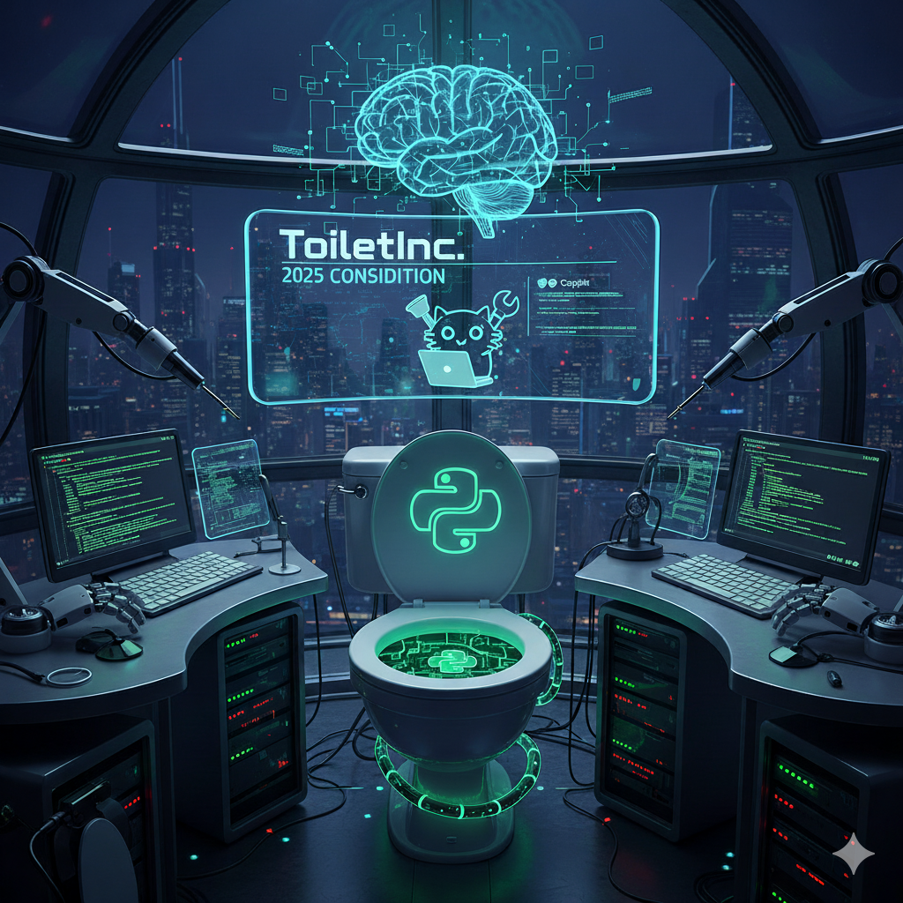

# Considition 2025



Algorithmic challenge to manage a fleet of electric vehicles efficiently.

## Quick Start

### 1. Initialize Game Environment
```bash
./script/game-init.sh
```
This sets up Docker, pulls the latest game engine, and verifies the installation.

### 2. Run Main Strategy
```bash
python python/automated_persona_strategy.py --map-name turbohill
```
The `automated_persona_strategy.py` is the main entry point for running simulations with persona-aware routing and charging decisions.

### 3. View Results
```bash
# Latest results
cat maps/turbohill/logs/latest/turbohill_cloud_result.json

# Summary
cat maps/turbohill/logs/latest/turbohill_iteration_summary.json
```

## Project Structure

```
.
├── python/                          # Python strategies and tools
│   ├── automated_persona_strategy.py  # 🎯 MAIN SCRIPT - Entry point for simulations
│   ├── game_simulator_v2.py         # Game engine integration
│   ├── collect_zone_weather_data.py # Weather data collection
│   └── visualize_*.py               # Visualization tools
├── script/                          # Utility scripts
│   ├── game-init.sh                # 🚀 Initialize game environment
│   ├── generate-map-*.sh           # Map generation utilities
│   └── compare-strategy-configs.sh # Strategy comparison
├── config/                          # Strategy configurations
│   ├── automated_persona_strategy_*.json  # Persona-based configs
│   └── examples/                    # Example configurations
├── maps/                            # Map-specific data and results
│   └── turbohill/                   # Turbohill training map
│       ├── turbohill-map.json      # Full map data
│       ├── turbohill-customers.json
│       ├── turbohill-stations.json
│       └── logs/                    # Simulation results
├── bruno-api/                       # API testing with Bruno
└── docker-compose.yml              # Local game engine

```

## Available Scripts

### Setup & Initialization

- **`script/game-init.sh`** - Initialize game environment
  ```bash
  ./script/game-init.sh
  ```
  Sets up Docker, pulls game engine, and verifies installation.

### Main Execution

- **`python/automated_persona_strategy.py`** - Main strategy script
  ```bash
  python python/automated_persona_strategy.py \
      --map-name turbohill \
      --mode iterative \
      --submit-to-cloud
  ```
  Runs persona-aware simulations with dynamic charging and routing decisions.

### Map Generation Scripts

- **`script/generate-map-summary.sh [MapName]`** - Generate map statistics
- **`script/generate-map-visualization.sh [MapName]`** - Create map visualizations
- **`script/generate-map-analysis.sh [MapName]`** - Full map analysis

### Python Utilities

Located in `python/` directory:

- **`game_simulator_v2.py`** - Game engine integration
- **`collect_zone_weather_data.py`** - Weather data collection
- **Visualization scripts:**
  - `visualize_map.py` - Map structure
  - `visualize_result.py` - Game results
  - `visualize_customer_journey.py` - Customer paths


## Key Features

✅ **Automated Strategy** - Persona-aware dynamic charging and routing via `automated_persona_strategy.py`
✅ **Easy Setup** - One-command initialization with `game-init.sh`
✅ **Cloud Submission** - Automatic leaderboard submission after full runs
✅ **Multi-Map Support** - Works with any training map via parameters
✅ **Complete Logging** - Full traceability of all simulations
✅ **Visualization Tools** - Analyze maps, customers, and results

## Workflow

### Development Cycle
1. **Initialize** - Set up game environment (first time only)
   ```bash
   ./script/game-init.sh
   ```

2. **Test Locally** - Run simulations for quick iteration
   ```bash
   python python/automated_persona_strategy.py \
       --map-name turbohill --mode iterative --end-tick 50
   ```

3. **Analyze Results** - Check logs and visualizations
   ```bash
   cat maps/turbohill/logs/latest/turbohill_iteration_summary.json
   ```

4. **Full Run** - Complete simulation with cloud submission
   ```bash
   python python/automated_persona_strategy.py \
       --map-name turbohill --submit-to-cloud
   ```

5. **Review Score** - Check cloud response for gameId and achievements
   ```bash
   cat maps/turbohill/logs/latest/turbohill_cloud_result.json
   ```

## Environment Setup

### First Time Setup
```bash
./script/game-init.sh
```
This handles Docker setup, game engine installation, and Python environment creation.

## API Endpoints

Local Docker: `http://localhost:8080`
- `/api/game` - Run game simulation
- `/api/map?mapName=Turbohill` - Get map data
- `/api/map-config?mapName=Turbohill` - Get map config
- `/scalar` - Interactive API documentation

Cloud: `https://api.considition.com`
- `/api/game` - Submit to leaderboard (requires API key)

## Competition Info

- **Training Phase**: November 3-12, 2025
- **Final Challenge**: November 13, 2025 (19:15)
- **Duration**: 45 minutes on secret map
- **Website**: https://www.considition.com

## License

Considition 2025 - Educational competition project
